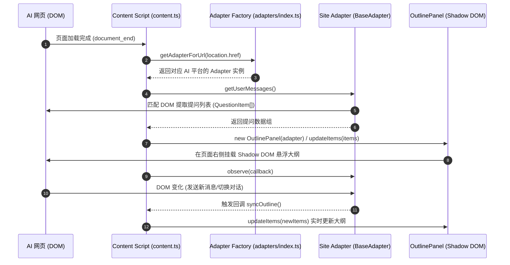

# AGENTS.md - AI Chat Outline Extension Agent 项目大纲指南

本文件为 AI Agent（如 Antigravity, Cursor, Copilot 等）提供本项目的架构大纲、技术细节与开发规范，以便快速理解项目结构并进行后续扩展与维护。

---

## 1. 项目概览 (Project Overview)

**项目名称**: `ai-chat-outline-extension` (AI Chat Outline - 对话提问大纲导航)  
**项目类型**: 跨浏览器插件 (Chrome / Firefox / Edge)  
**核心功能**: 为主流 AI 对话网站（Google Gemini, ChatGPT, Kimi, 腾讯元宝, 豆包等）自动解析用户提问列表，并在页面右侧渲染可折叠/可滚动的交互式大纲悬浮面板，点击节点可平滑滚动跳转至对应提问位置。

---

## 2. 技术栈 (Tech Stack)

- **开发框架**: [WXT (Web Extension Tools)](https://wxt.dev/) v0.19+
- **编程语言**: TypeScript
- **构建工具**: Vite (WXT 引擎内置)
- **UI 隔离**: Shadow DOM (避免 CSS 与宿主 AI 页面相互干扰)
- **样式**: Vanilla CSS + Dynamic Theme Switch (跟随系统/页面 Dark Mode)

---

## 3. 目录大纲与核心架构 (Directory Structure & Architecture)

```
ai-chat-outline-extension/
├── wxt.config.ts             # WXT 配置文件 (Manifest 权限、域名匹配、Gecko 设置等)
├── package.json              # 依赖与打包脚本
├── tsconfig.json             # TypeScript 配置
├── entrypoints/              # 插件入口文件
│   ├── background.ts         # Service Worker 后台脚本
│   └── content.ts            # 网页内容注入脚本 (匹配域名，调度 Adapter & OutlinePanel)
└── src/                      # 核心业务逻辑
    ├── types.ts              # TypeScript 类型定义 (QuestionItem, ChatAdapter)
    ├── components/           # UI 组件
    │   ├── OutlinePanel.ts   # 大纲面板主逻辑 ( Shadow DOM、事件监听、高亮联动)
    │   └── styles.css        # 面板样式文件
    └── adapters/             # AI 网页适配器模块
        ├── base.ts           # 适配器抽象基类 BaseAdapter (包含滚动容器查找、MutationObserver、清理前缀等)
        ├── chatgpt.ts        # ChatGPT 适配器
        ├── doubao.ts         # 豆包 (Doubao) 适配器
        ├── gemini.ts         # Google Gemini 适配器
        ├── kimi.ts           # Kimi Chat 适配器
        ├── yuanbao.ts        # 腾讯元宝 (Yuanbao) 适配器
        ├── generic.ts        # 通用 fallback 适配器
        └── index.ts          # 适配器注册与 URL 路由分发 (getAdapterForUrl)
```

---

## 4. 核心工作流程 (Core Logic Flow)



---

## 5. 适配器开发规范 (How to Add a New AI Platform Adapter)

若需要为新的 AI 网站添加提问大纲支持，请按如下步骤操作：

### 步骤 1: 创建 Adapter 文件 (`src/adapters/xxx.ts`)
继承 `BaseAdapter` 并实现抽象方法。可直接利用基类提供的 `extractQuestionItemsFromSelectors` 模版方法，或根据网页特点覆写 `scrollToQuestion`：

```typescript
import { BaseAdapter } from './base';
import { QuestionItem } from '../types';

export class NewPlatformAdapter extends BaseAdapter {
  name = 'NewPlatform';

  isMatch(url: string): boolean {
    return url.includes('newplatform.com');
  }

  getUserMessages(): QuestionItem[] {
    const selectors = [
      '.user-message-selector',
      '[data-role="user"]'
    ];

    // 利用基类下沉的模版方法，自动完成最外层节点去重与按钮/工具栏噪点清理
    return this.extractQuestionItemsFromSelectors(selectors);
  }

  // 可选：如果目标网页有特殊的滚动逻辑（如极端虚拟列表回收），可重写 scrollToQuestion
  override async scrollToQuestion(
    item: QuestionItem,
    allItems: QuestionItem[],
    prevActiveIndex: number
  ): Promise<void> {
    // 专属定位算法实现...
    await super.scrollToQuestion(item, allItems, prevActiveIndex);
  }
}
```

### 步骤 2: 在 `src/adapters/index.ts` 中注册
在 `adapters` 数组中引入并实例化新 Adapter（注意排序，特定平台的 Adapter 必须排在 `GenericAdapter` 之前）：

```typescript
import { NewPlatformAdapter } from './newplatform';

const adapters: ChatAdapter[] = [
  new GeminiAdapter(),
  new ChatGPTAdapter(),
  new KimiAdapter(),
  new YuanbaoAdapter(),
  new DoubaoAdapter(),
  new NewPlatformAdapter(), // <- 添加新适配器
  new GenericAdapter(),
];
```

### 步骤 3: 在配置中增加 Match 域名
修改 `wxt.config.ts` 和 `entrypoints/content.ts`：
1. `wxt.config.ts` 的 `host_permissions` 增加匹配规则 `https://*.newplatform.com/*`。
2. `entrypoints/content.ts` 的 `matches` 列表同步添加 `https://*.newplatform.com/*`。

---

## 6. 常用命令 (Commands)

| 命令 | 说明 |
| :--- | :--- |
| `npm run dev` | 启动 WXT 开发服务器（支持热重载） |
| `npm run build` | 编译构建 Chrome 扩展包（输出到 `.output/chrome-mv3`） |
| `npm run build:firefox` | 编译构建 Firefox 扩展包 |
| `npm run zip` | 打包生产环境 Chrome Zip 安装包 |
| `npm run compile` | 执行 TypeScript 类型检查 (`tsc --noEmit`) |
| `npm run release` | 递增 Patch 版本号并推送 tag 触发 GitHub Actions 自动发布 |

---

## 7. Agent 编码注意事项与规范 (Guidelines for AI Agents)

1. **样式隔离保障**: `OutlinePanel` 使用 **Shadow DOM** (`attachShadow({ mode: 'open' })`) 隔离样式。所有 UI 修改或新组件均需在 Shadow DOM 内部构造，切勿将全局 CSS 注入外部宿主页面。
2. **跳转定位架构隔离**: 平台特有的跳转定位策略（如虚拟列表回收探路、局部 scroll 视图定位）**必须完全内聚在专属 Adapter 中**（通过重写 `scrollToQuestion`），切勿在通用 `OutlinePanel` 中硬编码特定平台的特殊分支逻辑。
3. **基类公共工具复用**: 开发/重构 Adapter 时，优先使用 `BaseAdapter` 提供的 `findUserNodes`（防嵌套去重）、`cleanNodeText`（噪点清理）及 `extractQuestionItemsFromSelectors` 工具函数。
4. **选择器容错性**: AI 对话网站的 CSS 类名常被混淆或动态变更，提取元素时优先使用 `data-testid`、`role`、`aria-label` 或相对 DOM 深度遍历，避免强依赖极易失效的混淆 class。
5. **滚动容器兼容**: 滚动定位优先使用 `BaseAdapter.getScrollContainer()` 自动探测，或在 Adapter 中专属指定，并优先结合原生 `element.scrollIntoView({ behavior: 'smooth', block: 'start' })`。
6. **域名同步更新规则**: 只要修改或新增了支持的 AI 网站适配器，**必须同时**更新 `wxt.config.ts` (`host_permissions`) 和 `entrypoints/content.ts` (`matches`)，确保权限与匹配统一。
7. **Git Commit 规范**: 项目遵循中文 Commit Message 规范，格式推荐使用 `feat: ...` / `fix: ...` / `docs: ...` 加中文说明。

---

## 8. Agent Skills (Matt Pocock Skills 配置)

### Issue tracker

GitHub Issues via `gh` CLI. See `docs/agents/issue-tracker.md`.

### Triage labels

Canonical 5-role triage label vocabulary (`needs-triage`, `needs-info`, `ready-for-agent`, `ready-for-human`, `wontfix`). See `docs/agents/triage-labels.md`.

### Domain docs

Single-context layout (`CONTEXT.md` + `docs/adr/`). See `docs/agents/domain.md`.


